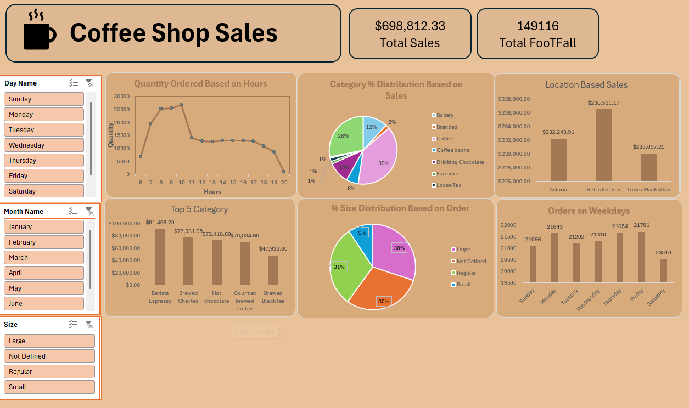

# ☕ Coffee Shop Sales Dashboard

Welcome to the **Coffee Shop Sales Dashboard** repository! This project provides a detailed analysis of coffee shop sales data, helping to track performance across multiple store locations and product categories. The dashboard offers insights into sales trends, product performance, and customer behavior.

## 📊 Dashboard Overview

The Coffee Shop Sales Dashboard is designed to provide an intuitive visual representation of the coffee shop’s sales performance. It includes the following key metrics:

- **Total Sales by Day of the Week**: Analyze which days are the most profitable.
- **Product Category Performance**: Understand which product categories drive the most revenue.
- **Sales by Hour**: Gain insights into peak times for sales, helping with staffing and inventory planning.

## 📁 Data Source

The data used in this dashboard comes from daily transactions recorded at various coffee shop locations. The dataset includes:

- **Transaction ID**: Unique identifier for each sale.
- **Date & Time**: Timestamp of the transaction.
- **Store Location**: Identifies the branch where the sale took place.
- **Product Details**: Type, category, and size of products sold.
- **Transaction Quantity**: The number of units sold.
- **Total Bill**: The total revenue generated by each transaction.

## 🚀 Features

- **Sales Trends by Day**: Visualize how sales fluctuate across different days of the week.
- **Product Performance Analysis**: Identify top-selling products and categories.
- **Hourly Sales Distribution**: Determine the most active hours in the day for sales.

## 🛠️ Tools Used

- **Microsoft Excel**: Used for data cleaning, analysis, and visualization.
- **Pivot Tables**: Aggregated data for a clearer understanding of sales performance.
- **Charts & Graphs**: Provide an intuitive visual representation of the data.

## 🖼️ Dashboard Screenshot

